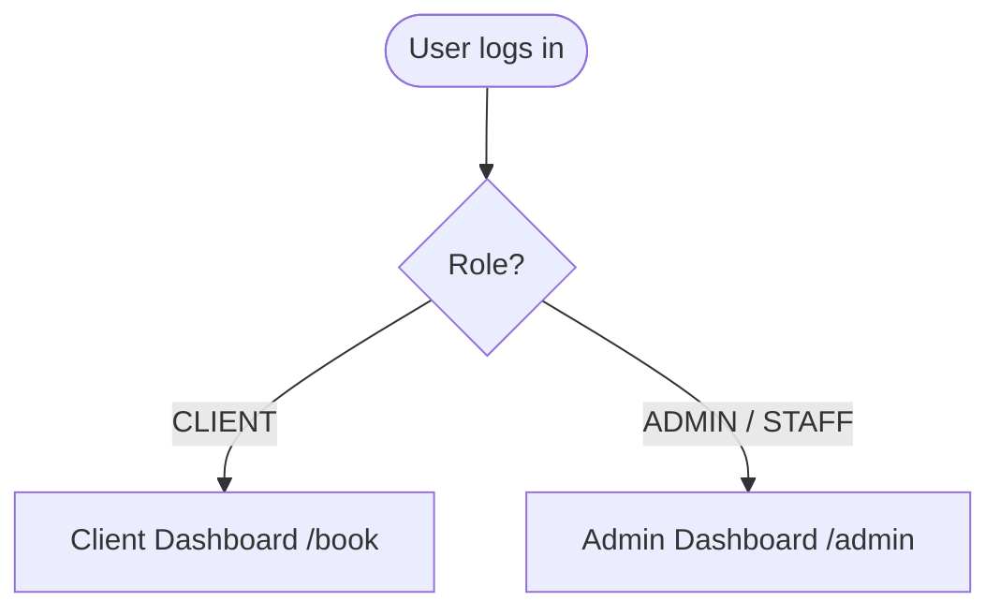
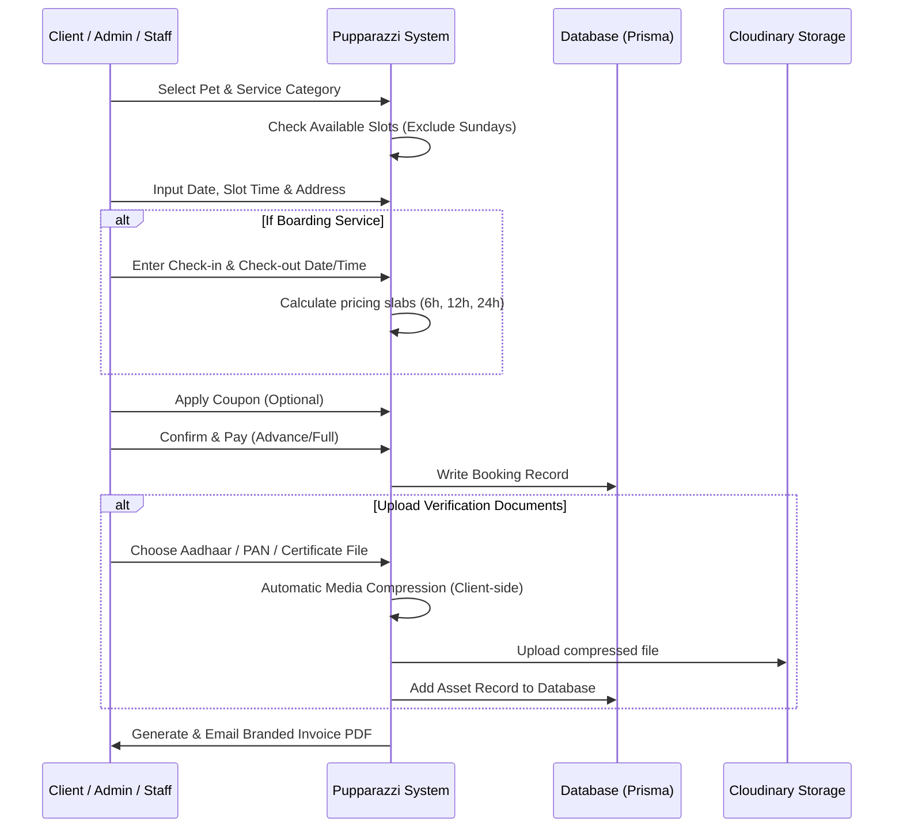

# Pupparazzi Premium Pet Care: Complete Guide & Operations Manual

Welcome to the official operations manual and guide for **Pupparazzi Premium Pet Care**. This document is designed to give you, your staff, and your clients a crystal-clear understanding of the system's terminology, features, and workflows.

---

## 1. Glossary of Terms (हर शब्द का मतलब)

To ensure everyone is on the same page, here is a detailed explanation of the terminology used throughout the Pupparazzi web application:

### Roles & Users (भूमिकाएं और उपयोगकर्ता)
*   **Client (क्लाइंट / ग्राहक)**: The pet owner. They log in to their dashboard, register their pets, book pet care services (Grooming/Boarding), upload required documents, make payments, and view their history.
*   **Staff (कर्मचारी)**: Operative team members. They can access the administrative dashboard (`/admin`) to view, manage, and approve bookings, check vaccination status, and assist clients.
*   **Admin (एडमिन / व्यवस्थापक)**: The system owner. Admins have unrestricted access to all dashboard settings, financial data, client records, services, coupons, testimonials, and user configurations.

### Key Financial Terms (वित्तीय शब्दावली)
*   **Revenue (राजस्व / कुल कमाई)**: The total value of all bookings created by a client. This is the gross amount billed to the user.
*   **Paid (भुगतान किया गया)**: The actual amount the client has already paid via integrated payment gateways (Razorpay, Gokwik, etc.) or cash.
*   **Due (बकाया राशि)**: The remaining balance that the client is yet to pay for their bookings. Calculated as: `Due = Revenue - Paid`.
*   **Wallet (वॉलेट बैलेंस)**: A digital purse for each client. Credits or refunds can be stored here. Clients can use their wallet balance to pay for future bookings.
*   **Outstanding (कुल देनदारी)**: The net amount the client owes to Pupparazzi across all historical bookings and invoices, accounting for refunds or advance deposits.
*   **Invoices (इनवॉइस / बिल)**: The official itemized receipts generated automatically for every booking. These list the services booked, tax, applied coupons, final amounts, and payment status, complete with the Pupparazzi logo and business address.

### Booking Categories (बुकिंग श्रेणियां)
*   **Grooming (ग्रूमिंग / पालतू पशु की सफाई)**: Single-session pet spa and salon services (e.g., bath, hair trimming, nail clipping, massage). These are booked for a specific date and time slot.
*   **Boarding (बोर्डिंग / हॉस्टल)**: Overnight or hourly lodging services for pets when owners are away. Boarding charges depend on the hours (slabs) or predefined packages.
*   **Service Group (सेवा समूह)**: A categorization of services (e.g., "Full Grooming Pack", "Spa Packages") used to display services neatly in tabs on the website.

---

## 2. Core Web Application Modules & Features

The application is structured into three main views based on the logged-in user's role:

### A. Client Dashboard (क्लाइंट पोर्टल)
Clients have a clean, premium, and fully responsive user interface to manage their pet care journey:
1.  **Home & Service Booking (`/book`)**: A highly styled landing screen where services are categorized by tabs (e.g., Grooming, Boarding).
2.  **Pet Registry (`/dashboard/pets`)**: Clients can add new pets, specifying breed, type, weight, dietary needs, allergies, preferences, and uploading medical/vaccination records.
3.  **My Bookings (`/dashboard/bookings`)**: Displays active, completed, and pending bookings.
4.  **Booking Details (`/dashboard/bookings/[id]/details`)**: Shows booking summary, assigned staff, address details, invoices, and a dedicated **Document Upload** card where they can upload Aadhaar Card, PAN Card, and Vaccine Certificates.
5.  **Secure Wallet (`/dashboard/wallet`)**: View current wallet balances and transaction logs.

### B. Admin & Staff Dashboard (एडमिन और स्टाफ पोर्टल)
Accessible at `/admin`, this is the command center of the system:
1.  **Overview Dashboard**: View today's bookings, revenue metrics, active clients, and quick stats.
2.  **Bookings Manager (`/admin/bookings`)**: Complete list of bookings. Admins can edit, reschedule, mark as completed/cancelled, or view details.
3.  **New Booking Console (`/admin/bookings/new`)**: A unified flow allowing admins to book a service for an *existing* customer or quick-create a *new* customer & pet in one smooth form.
4.  **Client Records (`/admin/clients`)**: A comprehensive directory of all registered clients. Click on any client to view their **Client Profile** containing detailed booking history, registered pets, full uploaded documents, and matches with legacy imported records.
5.  **Vaccination Directory (`/admin/vaccination-certificates`)**: Centralized dashboard to view and verify all uploaded pet vaccination certificates. Admins can view, download, print, or delete certificates directly.
6.  **Services & Coupons (`/admin/services` & `/admin/coupons`)**: Configure service details, prices, and create discount coupons.
7.  **Data Import (`/admin/old-data-import`)**: Process Excel/CSV files containing legacy clients, bookings, and payments, migrating them smoothly into the database.

---

## 3. Step-by-Step Booking Workflow (बुकिंग प्रक्रिया की कार्यप्रणाली)

The booking process is fully aligned and synchronized between the client and administrative flows.

### Step 1: Service & Pet Selection
*   **Client**: Selects which pet needs the service and picks a category (e.g., Grooming/Boarding) from the interactive booking wizard.
*   **Admin/Staff**: Chooses whether the booking is for an existing client or quick-creates a new user and pet directly on `/admin/bookings/new`.

### Step 2: Scheduling & Business Rules
*   **Availability Engine**: The booking engine queries the database to ensure slot limits are not exceeded for a given day.
*   **Sunday Restriction**: The system blocks any bookings scheduled on Sundays (both check-in and check-out dates for Boarding and slot dates for Grooming are restricted).
*   **Boarding Calculation**:
    *   If Boarding is selected, the user inputs check-in and check-out dates and times.
    *   The system calculates the exact hours:
        *   **≤ 6 Hours**: Hourly slab (Rs. 600)
        *   **6 to 12 Hours**: Half-day slab (Rs. 900)
        *   **> 12 Hours**: Daily slab (Rs. 1,200 per day)

### Step 3: Checkout & Coupon Discounts
*   Users can input promotional coupon codes (created by admins).
*   The discount is applied in real-time to the final amount.
*   Payments can be made online via integrated options, or marked as Cash-on-Delivery (COD) which requires a small advance payment.

### Step 4: Asset Upload & Document CRUD (Aadhaar, PAN, Vaccines)
*   For compliance, clients or admins upload Aadhaar, PAN, and Vaccination certificates.
*   **Automatic Compression**: Large images or PDFs are automatically routed through our compression utility to save bandwidth and storage.
*   **CRUD Deletion Workflow**: If an incorrect document is uploaded, it can be deleted:
    *   The client can delete it from their booking details page.
    *   The admin/staff can delete it from the Client Profile Drawer (`/admin/clients`) or the vaccination list (`/admin/vaccination-certificates`).
    *   Deleting a document deletes the reference in the database and cleans up the actual file from Cloudinary storage.

### Step 5: Automated Invoice Generation
*   Once booked, the database generates an invoice.
*   Admins can view and print this premium-designed invoice, which includes:
    *   Official Pupparazzi branding logo.
    *   Service breakdown, GST, discounts, and payment transactions.
    *   Clean layout suitable for desktop display or physical printing.

---

## 4. Operational Troubleshooting & Quick Actions

1.  **How to Reset Client Password?**
    *   Go to `/admin/clients`, find the customer, and expand their row.
    *   Type the new password in the "Reset Password" input and click the key icon.
2.  **How to Verify Vaccinations?**
    *   Go to `/admin/vaccination-certificates`.
    *   Review the pet's name, client name, and certificate preview.
    *   Use the search bar to filter by pet name or client details.
3.  **How to Manage Coupons?**
    *   Go to `/admin/coupons` and add a new coupon code (e.g., `PUPPY10`), set its discount percentage or flat rate, and hit save.
